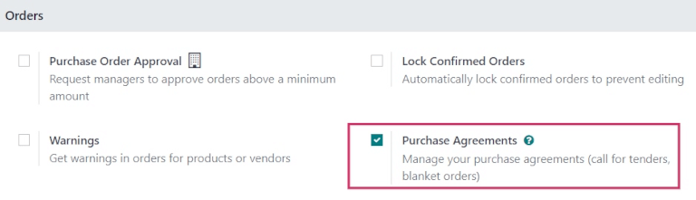
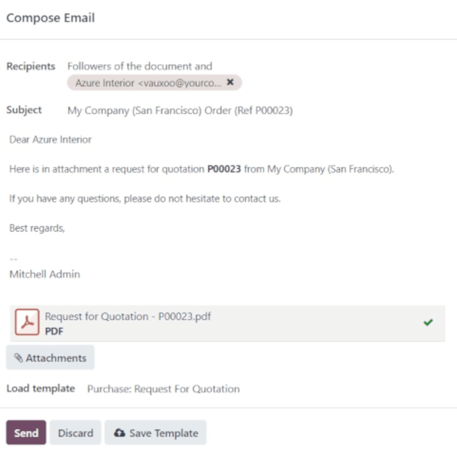

==================
Alternative |RfQs|
==================

.. _purchase/manage_deals/alternative-rfqs:

.. |PO| replace:: :abbr:`PO (Purchase Order)`
.. |POs| replace:: :abbr:`POs (Purchase Orders)`
.. |RfQ| replace:: :abbr:`RfQ (Request for Quotation)`
.. |RfQs| replace:: :abbr:`RfQs (Requests for Quotation)`

Sometimes, companies might want to request offers from multiple vendors at the same time, by
inviting those vendors to submit offers for similar goods or services all at once. This helps
companies to select the cheapest, fastest vendors, depending on their specific business needs.

In Odoo, this can be done by creating alternative requests for quotation (RfQs) for different
vendors. Once a response is received from each vendor, the product lines from each |RfQ| can be
compared, and a decision can be made for which products to purchase from which vendors.

.. note::
   Sometimes referred to as a *call for tender*, this process is primarily used by organizations in
   the public sector, who are legally bound to use it when making a purchase. However, private
   companies can also use alternative |RfQs| to spend money efficiently.

Configuration
=============

To create alternative |RfQs|, the *Purchase Agreements* feature **must** be enabled in the
*Purchase* app settings. To enable the feature, navigate to :menuselection:`Purchase app -->
Configuration --> Settings`. Under the :guilabel:`Orders` section, click the checkbox for
:guilabel:`Purchase Agreements`.

Doing so enables the ability to create alternative |RfQs|, as well as *blanket orders*.

.. tip::
   To save time creating alternative |RfQs|, custom vendors, prices, and delivery lead times can be
   set in the :guilabel:`Purchase` tab of a product form.

   Navigate to :menuselection:`Purchase app --> Products --> Products`, and select a product to
   edit. On the product form, click the :guilabel:`Purchase` tab, and click :guilabel:`Add a line`.

   From the drop-down menu, choose a vendor to set under the :guilabel:`Vendor` column, and set a
   :guilabel:`Price` and :guilabel:`Delivery Lead Time`, if necessary. Clicking the
   :guilabel:`⋮ (three dots)` icon provides additional visibility options to add to the line item.

Create an |RfQ|
===============

To create a new |RfQ|, navigate to the :menuselection:`Purchase` app, and click :guilabel:`New`.

On the blank |RfQ| form, add a vendor from the drop-down next to the :guilabel:`Vendor` field, and
click :guilabel:`Add a product` to select a product from the drop-down menu in the
:guilabel:`Product` column.

Then, set the desired quantity to purchase in the :guilabel:`Quantity` column, and change the
purchase price in the :guilabel:`Unit Price` column, if necessary.

Clicking the :guilabel:`⋮ (three dots)` icon provides additional visibility options to add to the
line item.

Repeat these steps to add as many options as desired, including the :guilabel:`UoM` (Units of
Measure) to purchase the products in, and the :guilabel:`Expected Arrival` date.

Once ready, click :guilabel:`Send by Email`.

This opens a :guilabel:`Compose Email` pop-up window, wherein the message to the vendor can be
customized. Once ready, click :guilabel:`Send`.

This turns the |RfQ| into a purchase order (PO), and sends an email to the vendor listed on the |PO|
form.

.. note::
   Sending emails to each vendor can be useful when creating alternative |RfQs|, because vendors can
   confirm if their past prices still hold today, which helps companies choose the best offers for
   them.

Create alternative |RfQs|
=========================

Once a |PO| is created and sent to a vendor, alternative |RfQs| can be created for additional
vendors to compare prices, delivery times, and other factors, to help make a decision for the order.

To create alternative |RfQs|, from the |PO| form, click the :guilabel:`Alternatives` tab. Then,
click :guilabel:`Create Alternative`. When clicked, a :guilabel:`Create alternative` pop-up window
appears.

.. image:: calls_for_tenders/calls-for-tenders-create-alternative.png
   :align: center
   :alt: Calls for tenders pop-up to create alternative quotation.

From this window, select an alternative vendor from the drop-down menu next to the
:guilabel:`Vendor` field, to whom the alternative quotation is assigned.

Next to this, there is a :guilabel:`Copy Products` checkbox that is selected by default. When
selected, the product quantities of the original |PO| are copied over to the alternative. For this
first alternative quotation, leave the checkbox checked. Once finished, click :guilabel:`Create
Alternative`. This opens a new |PO|.

Since the :guilabel:`Create Alternative` checkbox was left checked, the new form is already
pre-populated with the same products, quantities, and other details as the previous, original |PO|.

.. note::
   When the :guilabel:`Copy Products` checkbox is selected while creating an alternative quotation,
   additional products do **not** need to be added unless desired.

   However, if a chosen vendor is listed in the :guilabel:`Vendor` column under a specific product
   form included in the order, the values set on the product form carry over to the |PO|, and
   **must** be changed manually, if necessary.

Once ready, create a second alternative quotation by clicking the :guilabel:`Alternatives` tab,
followed by :guilabel:`Create Alternative`.

This opens the :guilabel:`Create alternative` pop-up window. Once again, choose a different vendor
from the drop-down menu next to :guilabel:`Vendor`. For this particular |RfQ|, however, *uncheck*
the :guilabel:`Copy Products` checkbox. Doing so removes all products on the new alternative |RfQ|,
leaving it blank. Products can be added in as needed.

Once ready, click :guilabel:`Create Alternative`.

.. tip::
   If an alternative quotation should be removed from the :guilabel:`Alternatives` tab, they can be
   individually removed by clicking on the :guilabel:`Remove (X)` icon at the end of their row.

This creates a third, new |PO|. But, since the product quantities of the original |PO| were **not**
copied over, the product lines are empty, and new products must be added by clicking :guilabel:`Add
a product`, and selecting the desired products from the drop-down menu.

Once the desired number of products are added, click :guilabel:`Send by Email`.

.. image:: calls_for_tenders/calls-for-tenders-blank-quotation.png
   :align: center
   :alt: Blank alternative quotation with alternatives in breadcrumbs.

This opens a :guilabel:`Compose Email` pop-up window, wherein the message to the vendor can be
customized. Once ready, click :guilabel:`Send`.

From this newest form, click the :guilabel:`Alternatives` tab. Under this tab, all three |POs| can
be seen in the :guilabel:`Reference` column. Additionally, the vendors are listed under the
:guilabel:`Vendor` column, and the order :guilabel:`Total` and :guilabel:`Status` of the orders are
in the rows, as well.

Link a new |RfQ| to existing quotations
=======================================

Even if a quotation is not created directly from the :guilabel:`Alternatives` tab of another |RfQ|,
it can still be linked to existing |RfQs|.

Begin with creating a new |RfQ|, by navigating to :menuselection:`Purchase app --> New`. Fill out
the |RfQ| according to the earlier instructions.

Then, once ready, click the :guilabel:`Alternatives` tab. Since this new |PO| was created
separately, there are no other orders linked yet.

To link this order with alternatives, click :guilabel:`Link to Existing RfQ` on the first line in
the :guilabel:`Vendor` column.

.. image:: calls_for_tenders/calls-for-tenders-link-rfq-popup.png
   :align: center
   :alt: Pop-up to link new quotation to existing RFQs.

This opens an :guilabel:`Add: Alternative POs` pop-up window. Select the three previously-created
|POs|, and click :guilabel:`Select`. All of these orders are now copied to this |PO|, and can be
found under the :guilabel:`Alternatives` tab.

.. tip::
   If a large number of |POs| are being processed and the previous |POs| can't be located, click
   :menuselection:`Group By --> Vendor` (under the search bar, at the top of the pop-up window) to
   group the vendors selected on the previous orders.

Compare product lines
=====================

Alternative |RfQs| can be compared side-by-side in order to determine which vendors offer the best
deals on the products included in the orders.

To compare alternative |RfQs|, navigate to the :menuselection:`Purchase` app, and select one of the
previously-created |RfQs|.

Click the :guilabel:`Alternatives` tab to see all linked |RfQs|. Then, under the :guilabel:`Create
Alternative` tab, click :guilabel:`Compare Product Lines`. This navigates to the :guilabel:`Compare
Order Lines` page.

.. image:: calls_for_tenders/calls-for-tenders-compare-products.png
   :align: center
   :alt: Compare Product Lines page for alternative RFQs.

The :guilabel:`Compare Order Lines` page, by default, groups by :guilabel:`Product`. Each product
included in any of the |RfQs| is displayed in its own drop-down, and lists all of the |PO| numbers
in the :guilabel:`Reference` column.

Additional columns on this page include the :guilabel:`Vendor` from which products were ordered,
the :guilabel:`Status` of the quotation (e.g., RFQ, RFQ Sent), the :guilabel:`Quantity` of products
ordered from each vendor, the :guilabel:`Unit Price` per product, and the :guilabel:`Total` price of
the order.

.. note::
   To remove product lines from the :guilabel:`Compare Order Lines` page, click :guilabel:`Clear` at
   the far-right end of that product line's row.

   Doing so removes this specific product as a selectable option from the page, and changes the
   :guilabel:`Total` price of that product on the page to **0**.

   Additionally, on the |PO| form in which that product was included, its ordered quantity is also
   changed to **0**.

Once the best offers have been identified, individual products can be selected by clicking the
:guilabel:`Choose` button at the end of each corresponding row.

Once all desired products have been chosen, click :guilabel:`Requests for Quotation` (in the
breadcrumbs, at the top of the page) to navigate back to an overview of all |RfQs|.

Cancel (or keep) alternatives
=============================

Once the desired products have been chosen from the :guilabel:`Compare Order Lines` page, the
remaining |RfQs| from which no products were chosen can be canceled.

The cost in the :guilabel:`Total` column for each product that wasn't chosen is automatically set to
**0**, indicated at the far-right of each corresponding row.

Although they haven't been canceled yet, this indicates that each of those orders can be canceled
without having an effect on the other live orders, once those orders have been confirmed.

.. image:: calls_for_tenders/calls-for-tenders-zero-total.png
   :align: center
   :alt: Canceled quotations in the Purchase app overview.

To confirm an |RfQ| for which products **were** selected, click into one, and click
:guilabel:`Confirm Order`.

This causes a pop-up window reading :guilabel:`What about the alternative Requests for Quotations?`
to appear. From the pop-up window, two options are presented: :guilabel:`Cancel Alternatives` and
:guilabel:`Keep Alternatives`.

If this |PO| should **not** be confirmed, click :guilabel:`Discard`.

Selecting :guilabel:`Cancel Alternatives` automatically cancels the alternative |RfQs|. Selecting
:guilabel:`Keep Alternatives` keeps the alternative |RfQs| open, so they can still be accessed if
any additional product quantities need to be ordered later.

Once all products are ordered, :guilabel:`Cancel Alternatives` can be selected from whichever |PO|
is open at that time.

.. image:: calls_for_tenders/calls-for-tenders-keep-or-cancel.png
   :align: center
   :alt: Keep or cancel pop-up for alternative RFQs.

To view a detailed form of one of the |RfQs| listed, click the line item for that quotation. This
opens an :guilabel:`Open: Alternative POs` pop-up window, from which all details of that particular
|RfQ| can be viewed.

Once ready, click :guilabel:`Close` to close the pop-up window.

If all alternative |RfQs| should stay open, from the :guilabel:`What about the alternative Requests
for Quotations?` pop-up window, click :guilabel:`Keep Alternatives`.

Then, click :guilabel:`Requests for Quotation` (in the breadcrumbs, at the top of the page) to
navigate back to an overview of all |RfQs|.

Click into the remaining |RfQs| that contain products that need to be ordered, and click
:guilabel:`Confirm Order`.

This opens the :guilabel:`What about the alternative Requests for Quotations?` pop-up window. This
time, click :guilabel:`Cancel Alternatives` to cancel all other alternative |RfQs| linked with this
order.

Finally, click :guilabel:`Requests for Quotation` (in the breadcrumbs, at the top of the page) to
navigate back to an overview of all |RfQs|.

The canceled orders can be seen, greyed out and listed with a :guilabel:`Cancelled` status, under
the :guilabel:`Status` column at the far-right of their respective rows.

Now that all product quantities have been ordered, the purchase process can be completed, and the
products can be received into the warehouse.

.. seealso::
   :doc:`blanket_orders`
